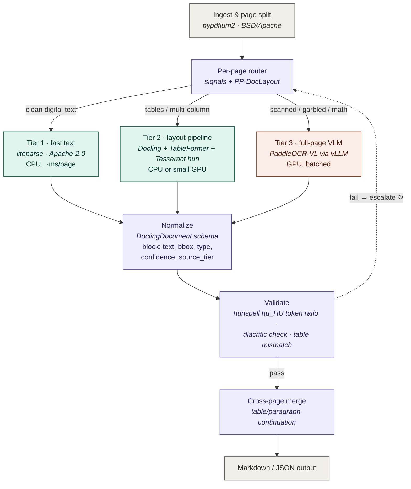
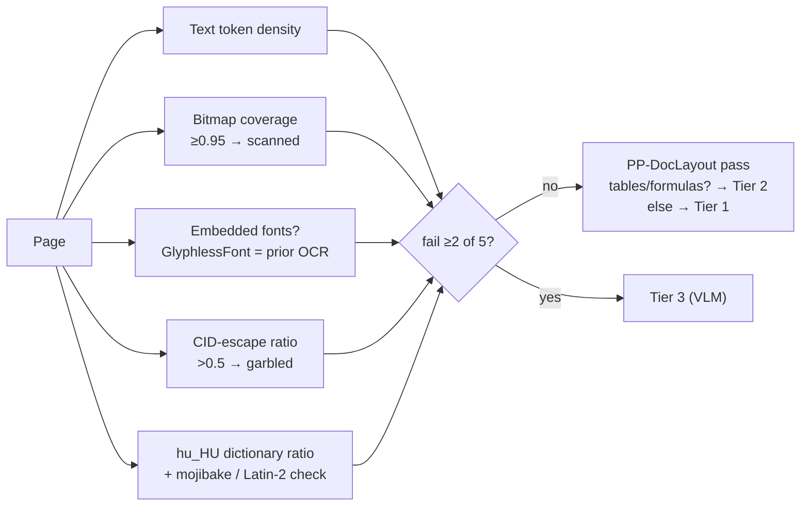

# Tiered PDF → Markdown pipeline — reference architecture

Self-hosted, permissive-license-only (MIT / Apache-2.0 / BSD), pluggable, Hungarian-first.

## Architecture



The dashed edge is the escalation path: a page that fails validation is re-routed to the next tier up, so a bad tier-1 parse costs one retry, not a corrupted document.

### Router decision signals (per page, <1 ms on CPU)



## Pluggable slots

Every tier implements one interface and emits one schema:

```python
class Parser(Protocol):
    def parse(self, page: PageInput) -> list[Block]: ...

@dataclass
class Block:
    text: str
    bbox: tuple[float, float, float, float]
    type: BlockType          # text | table | formula | figure | ...
    confidence: float
    source_tier: int         # 1 | 2 | 3
    page_index: int
```

Tier 3 hides behind an OpenAI-compatible vLLM endpoint, so swapping the VLM is a config change (URL + model name), not a code change. The router is a policy object reading thresholds from config.

| Slot | Pick | License | Swap candidates |
|---|---|---|---|
| PDF signals / split | pypdfium2 | BSD/Apache | pdfplumber (MIT) |
| Layout signal | PP-DocLayout | Apache-2.0 | — (DocLayout-YOLO is AGPL, avoid) |
| Tier 1 | liteparse | Apache-2.0 | pdfplumber-based extractor |
| Tier 2 | Docling + TableFormer + Tesseract `hun` | MIT / Apache | RapidOCR engine in Docling |
| Tier 3 | PaddleOCR-VL via vLLM | Apache-2.0 | dots.ocr, Granite-Docling (both Apache) |
| Schema | DoclingDocument | MIT | custom Pydantic schema |
| Queue / serving | Celery or RQ + vLLM | BSD / Apache | docling-serve, Ray |

### Serving the VLM tier

```bash
vllm serve PaddlePaddle/PaddleOCR-VL --trust-remote-code \
  --max-num-batched-tokens 16384
# clients POST page images to /v1/chat/completions
```

## Excluded for licensing

| Excluded | Reason | Replacement |
|---|---|---|
| PyMuPDF / pymupdf4llm | AGPL-3.0 | pypdfium2 + liteparse |
| Marker | GPL-3.0 code + OpenRAIL-M weights | Docling (tier 2), PaddleOCR-VL (tier 3) |
| Surya (weights), DocLayout-YOLO | OpenRAIL-M / AGPL | PP-DocLayout |
| olmOCR 2 | Apache but English-focused | PaddleOCR-VL (multilingual) |
| MinerU | Permissive-ish 2026 license, but attribution conditions | Optional — add only if its hybrid mode wins on your corpus |

## Hungarian specifics

1. **Tier 3 model choice is forced.** olmOCR 2 is English-focused, so it's out. PaddleOCR-VL's 109-language coverage includes Hungarian; dots.ocr covers it too. Benchmark both on *your* scans — published multilingual scores rarely break out Hungarian.
2. **The double acute is your canary.** The classic Hungarian OCR failure is ő/ű collapsing into ö/ü or õ/û. Build a small eval set of pages dense in ő/ű and make double-acute accuracy an explicit per-tier metric. Tesseract `hun` handles it well on clean scans; VLM output on degraded scans is where drift appears.
3. **Validation must be Hungarian-aware.** The dictionary-word-ratio garble check needs the hu_HU hunspell dictionary (hunspell lib is MPL-optioned tri-license; dictionary files as runtime data don't affect your code's license). An English wordlist would flag every correct Hungarian page as garbage and escalate the whole corpus to the GPU.
4. **Legacy encodings route to OCR.** Set `lang=hun` explicitly in Tesseract (no autodetect), and add a mojibake pattern for Latin-2 / CP-1250 text layers — older Hungarian PDFs often carry broken `õ`-for-`ő` embedded text, which should skip tier 1 entirely.

## Rollout plan

| Stage | Scope |
|---|---|
| 1 | Router + tier 1: pypdfium2 signals, "fail 2 of 5" voting rule, liteparse, DoclingDocument normalization with `source_tier` from day one |
| 2 | Tier 2 + validation: PP-DocLayout signal, Docling+TableFormer+Tesseract `hun`, hu_HU garble checks, escalation logging |
| 3 | Tier 3: PaddleOCR-VL on vLLM, async batched page images, temperature-ramp retries, document-level max error rate (~0.004) |
| 4 | Cross-page table/paragraph merge, page-image hash cache, per-tier cost and escalation-rate metrics |

Primary tuning signal: the escalation matrix (tier 1 → 3 rate). Escalation >~30% means the router thresholds are miscalibrated or the corpus is scan-heavier than assumed.
